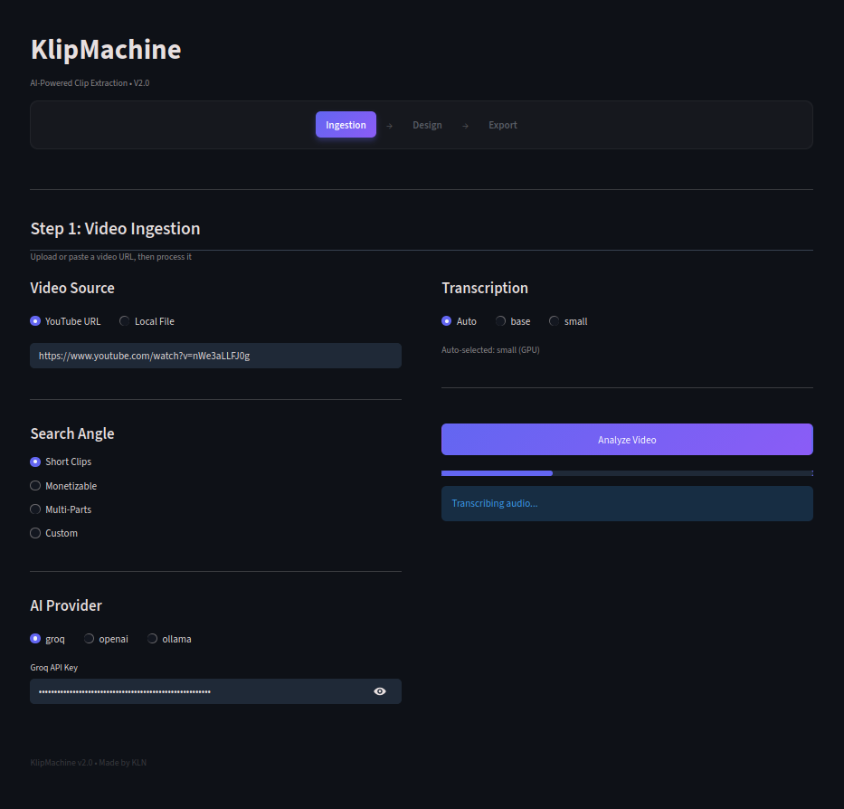
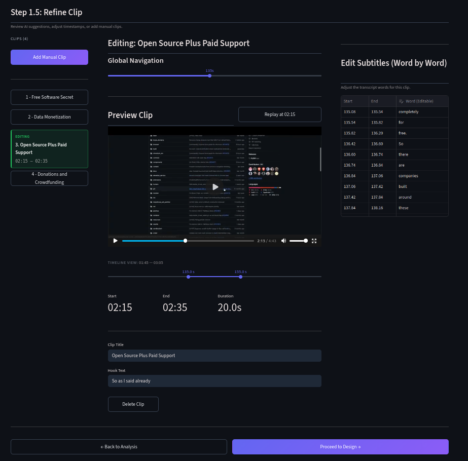
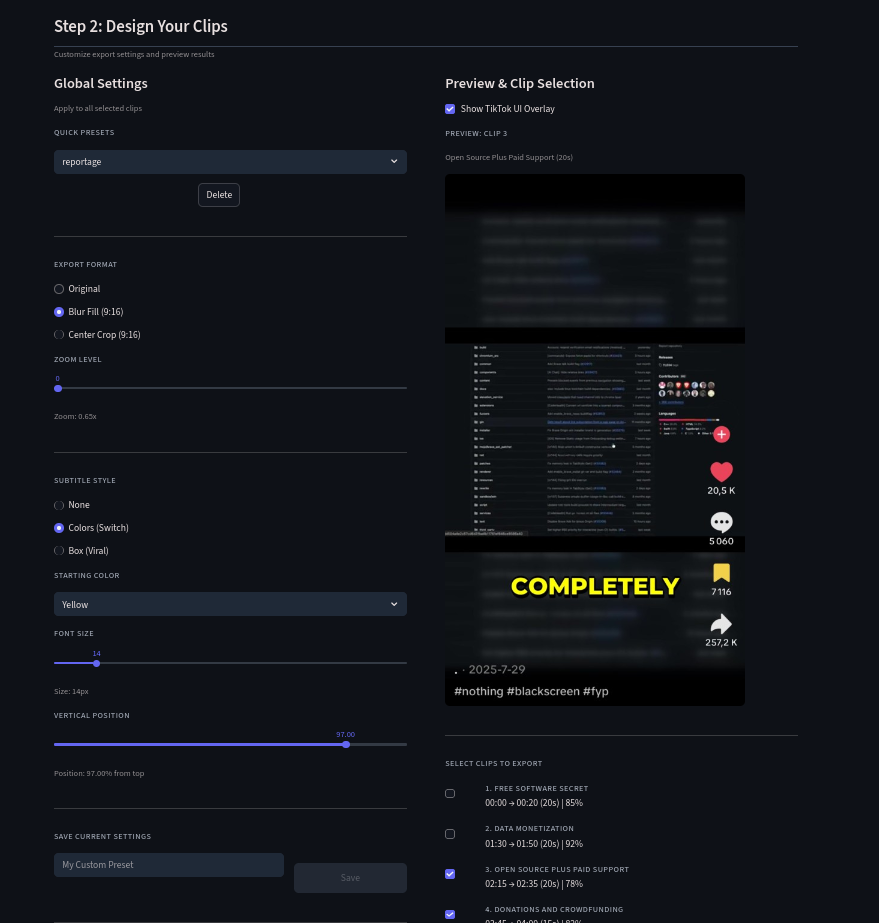
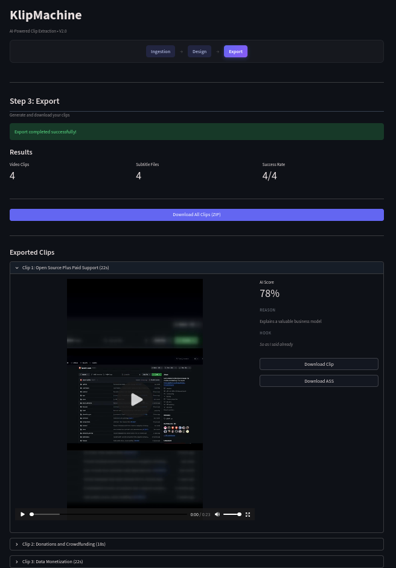

# KlipMachine

KlipMachine is a Python-based pipeline and Streamlit web application designed to automate the extraction and formatting of short-form video clips from long-form content. It handles video ingestion, audio transcription, AI-driven moment detection, and automated video editing.

## Technical Architecture

The application is built around a state machine workflow, separating the heavy media processing tasks from the user interface. 

* **Ingestion & Analysis**: Uses `yt-dlp` for video downloading and `faster-whisper` for word-level audio transcription. The transcript is chunked and analyzed by LLMs (supporting Groq, OpenAI, or Ollama) to identify high-retention segments based on custom or predefined prompts.
* **Video Processing**: Relies on FFmpeg for all media manipulation. It includes hardware acceleration detection (NVENC, VideoToolbox) to optimize render times.
* **Dynamic Subtitles**: Uses libass to burn in subtitles. For advanced styles, the application uses OpenCV and PIL to calculate pixel-accurate bounding boxes around text, generating per-word highlight masks that are composited via FFmpeg filter graphs.
* **Interface**: Built with Streamlit, managing complex states across the editing session to allow real-time previewing without re-rendering the full video.

## Installation

### Prerequisites
* Python 3.10+
* FFmpeg (must be installed and accessible in your system PATH).

### Setup
1. Clone the repository and navigate to the project directory:
   ```bash
   git clone <your-repo-url>
   cd klipmachine
   ```
2. Install the required dependencies:
   ```bash
   pip install -r requirements.txt
   ```
3. Create a `.env` file at the root of the project to store your API keys:
   ```env
   GROQ_API_KEY=your_groq_key
   OPENAI_API_KEY=your_openai_key
   ```
   *(Note: Keys can also be entered directly in the application UI during Step 1).*

## Usage

Start the application using Streamlit:

```bash
streamlit run app.py
```

## Workflow Overview

### Step 1: Video Ingestion


The pipeline accepts either a YouTube URL or a local video file. You define the search angle (e.g., Short Clips, Monetizable) and select the AI provider for analysis. The backend extracts the audio, runs Whisper for transcription, and delegates segment analysis to the LLM.

### Step 1.5: Refine Clip


Before rendering, you can review the AI suggestions. The interface provides a global seek slider and a fine-tune timeline to adjust the start and end boundaries of each clip. A data editor allows for word-by-word correction of the generated transcript to fix spelling or timing errors.

### Step 2: Design


Configure the visual output of the selected clips. You can apply crop modes (Original, Center Crop 9:16, or Blur Fill 9:16) and customize subtitle styles, font sizes, colors, and vertical positioning. A real-time preview generator extracts a single frame and composites the requested filters and text to validate the design before initiating a full render.

### Step 3: Export


The final step handles batch rendering. It executes a two-pass FFmpeg operation (video extraction, followed by subtitle burn-in) for stability. Once processed, clips can be downloaded individually alongside their respective `.srt` or `.ass` subtitle files, or packaged into a single ZIP archive.